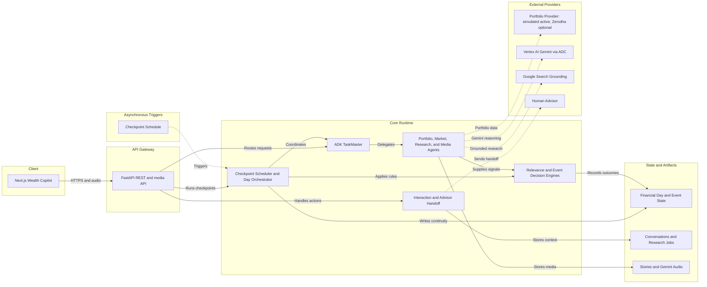
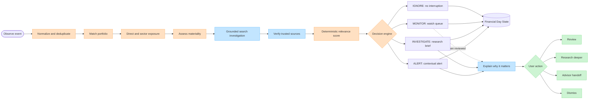
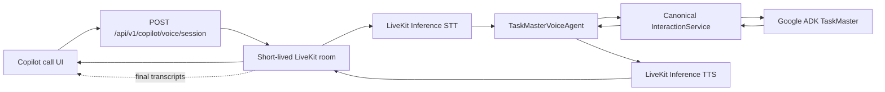

# Wealth Copilot System Architecture

This document describes the implementation currently present in the repository. The diagrams use product-facing names where those names are clearer, with the source implementation name shown in parentheses when useful.

## 1. Overall System Architecture

This is a logical runtime architecture rather than a claim that every box is independently deployed. The Next.js experience exposes the dashboard, chat, generated audio, and Daily Wealth Story through the FastAPI boundary. TaskMaster routes intent and delegates specialist work, while deterministic code owns relevance scoring and event decisions. The active demo portfolio is simulated, Zerodha remains an optional provider adapter, and Gemini reasoning and TTS use Vertex AI through Application Default Credentials. Google Search is the grounded market/news path, not a portfolio provider.

## 2. Attention Decision Pipeline

Blue steps are agent-assisted investigation and explanation. Orange steps are deterministic matching, exposure calculation, materiality assessment, scoring, and triage. Every outcome is persisted with provenance; only material `MONITOR`, `INVESTIGATE`, or `ALERT` items reach the explanation and user-action path. `IGNORE`, `MONITOR`, `INVESTIGATE`, and `ALERT` express attention priority, never a trade instruction.

## 3. Autonomous Financial Day

`FinancialDayState` carries the shared `day_id`, `run_id`, timeline, event assessments, portfolio snapshots, audio identifiers, market-close review, advisor interactions, tomorrow items, and Daily Wealth Story identity. The HDFC event is not a scheduled checkpoint: it enters the Event Watcher when its market trigger occurs during market hours.

### Live voice call path

The worker supplies no independent financial reasoning model. Its LiveKit LLM slot is a non-callable sentinel, and `llm_node` delegates to `InteractionService` with `mode=call`; any bypass fails explicitly. The room is dispatched by the short-lived token to the configured `wealth-copilot` worker.

## 4. HDFC Hero Event Sequence

The demonstrated values are the current deterministic HDFC scenario values: HDFCBANK `-5.4%`, sector `-0.8%`, direct exposure `17.21%`, sector exposure `27.26%`, and relevance `93.11 / 100`. TaskMaster surfaces and explains the retained decision; it does not calculate the deterministic score itself.

## How to explain this in 30 seconds

“Wealth Copilot has one conversational TaskMaster supervising several focused specialists. It reads a simulated portfolio and live Google Search market context, then deterministic code matches stories to holdings, measures exposure, and decides what deserves attention. During the financial day, the same FinancialDayState carries context from Morning Pulse through an event-triggered HDFC alert, market close, Evening Wrap, and the Daily Wealth Story. I can ask for an explanation, launch deeper source-first research, or bring a human advisor into the loop. The system prioritizes information; I still decide what to do.”

## Judge-facing technical highlights

- Google ADK `root_agent` is the TaskMaster supervisor and intent router; specialist agents remain explicit delegates.
- `daily_brief_workflow` parallelizes portfolio and market collection, then applies deterministic relevance and diversity ranking.
- `RelevanceEngine` is explainable deterministic scoring over direct holding, exposure, sector, materiality, freshness, and movement signals.
- `EventDecisionEngine` owns trigger rules, investigation status, relevance evaluation, and `IGNORE` / `MONITOR` / `INVESTIGATE` / `ALERT` decisions without an LLM.
- `FinancialDayState` plus `FinancialDayStore` provide durable continuity across orchestrated checkpoints, event history, audio, advisor, and story outputs.
- The active demo uses `SimulatedPortfolioProvider`; Google Search grounding is the live news path, while Zerodha is an optional provider implementation and is not active in this architecture.
