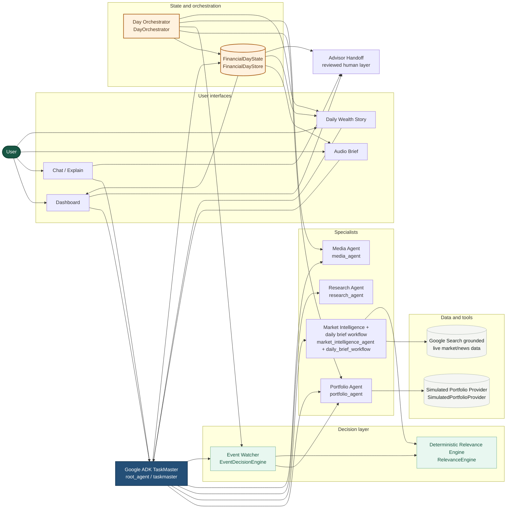
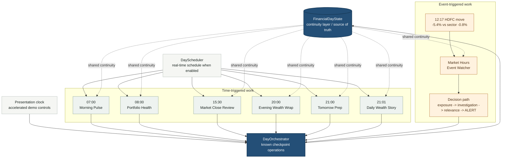
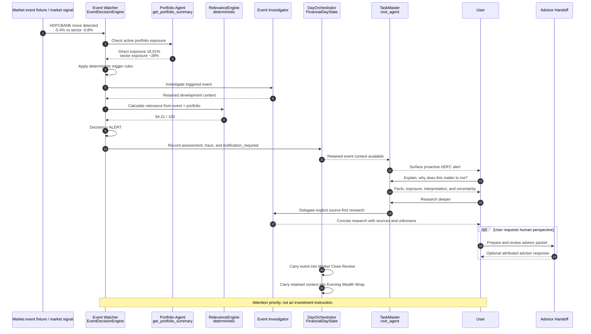

# Wealth Copilot System Architecture

This document describes the implementation currently present in the repository. The diagrams use product-facing names where those names are clearer, with the source implementation name shown in parentheses when useful.

## 1. Overall System Architecture

The four interfaces share the same TaskMaster and retained underlying context. TaskMaster routes intent and delegates work; it does not replace the deterministic scoring or event-decision code. The active demo portfolio is simulated. Google Search is the live market/news path when configured; it is not a portfolio provider.

## 2. Attention Decision Pipeline

```mermaid
flowchart LR
    observe[Observe market and news]
    filter[Filter noise<br/>normalize and deduplicate]
    match[Match against portfolio<br/>holdings and sectors]
    exposure[Calculate direct and<br/>sector exposure]
    materiality[Assess materiality<br/>event type and movement]
    investigate[Investigate<br/>when a trigger fires]
    score[Calculate relevance score<br/>RelevanceEngine - deterministic]
    decision{Decision}
    ignore[IGNORE]
    monitor[MONITOR]
    investigateOutcome[INVESTIGATE]
    alert[ALERT]
    explain[Explain context<br/>facts, interpretation, unknowns]
    userdecides[User decides what to do]

    observe --> filter --> match --> exposure --> materiality --> investigate --> score --> decision
    decision --> ignore & monitor & investigateOutcome & alert
    ignore & monitor & investigateOutcome & alert --> explain --> userdecides

    note[Attention decisions indicate information priority,<br/>not investment instructions.]
    explain -.-> note

    classDef process fill:#f5f6f3,color:#17211d,stroke:#aab5ad;
    classDef deterministic fill:#e8f7f0,color:#14533d,stroke:#6aac8e;
    classDef outcome fill:#fff2df,color:#4d3218,stroke:#ad641f;
    classDef boundary fill:#eef3f0,color:#30473c,stroke:#9aaea1,stroke-dasharray: 5 5;

    class observe,filter,match,exposure,materiality,investigate,explain,userdecides process;
    class score deterministic;
    class decision,ignore,monitor,investigateOutcome,alert outcome;
    class note boundary;
```

The daily brief uses `RelevanceEngine` to normalize, portfolio-match, score, and rank candidate news. The Event Watcher uses the same relevance engine after its deterministic trigger rules and investigation path. `IGNORE`, `MONITOR`, `INVESTIGATE`, and `ALERT` express attention priority; none is a trade instruction.

## 3. Autonomous Financial Day

`FinancialDayState` carries the shared `day_id`, `run_id`, timeline, event assessments, portfolio snapshots, audio identifiers, market-close review, advisor interactions, tomorrow items, and Daily Wealth Story identity. The HDFC event is not a scheduled checkpoint: it enters the Event Watcher when its market trigger occurs during market hours.

## 4. HDFC Hero Event Sequence

The demonstrated values are the current deterministic HDFC scenario values: HDFCBANK `-5.4%`, sector `-0.8%`, direct exposure `18.01%`, sector exposure approximately `28%`, and relevance `94.21 / 100`. TaskMaster surfaces and explains the retained decision; it does not calculate the deterministic score itself.

## How to explain this in 30 seconds

“Wealth Copilot has one conversational TaskMaster supervising several focused specialists. It reads a simulated portfolio and live Google Search market context, then deterministic code matches stories to holdings, measures exposure, and decides what deserves attention. During the financial day, the same FinancialDayState carries context from Morning Pulse through an event-triggered HDFC alert, market close, Evening Wrap, and the Daily Wealth Story. I can ask for an explanation, launch deeper source-first research, or bring a human advisor into the loop. The system prioritizes information; I still decide what to do.”

## Judge-facing technical highlights

- Google ADK `root_agent` is the TaskMaster supervisor and intent router; specialist agents remain explicit delegates.
- `daily_brief_workflow` parallelizes portfolio and market collection, then applies deterministic relevance and diversity ranking.
- `RelevanceEngine` is explainable deterministic scoring over direct holding, exposure, sector, materiality, freshness, and movement signals.
- `EventDecisionEngine` owns trigger rules, investigation status, relevance evaluation, and `IGNORE` / `MONITOR` / `INVESTIGATE` / `ALERT` decisions without an LLM.
- `FinancialDayState` plus `FinancialDayStore` provide durable continuity across orchestrated checkpoints, event history, audio, advisor, and story outputs.
- The active demo uses `SimulatedPortfolioProvider`; Google Search grounding is the live news path, while Zerodha is an optional provider implementation and is not active in this architecture.